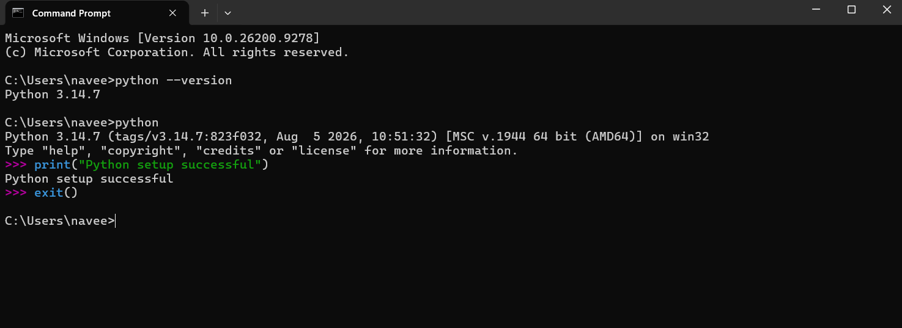
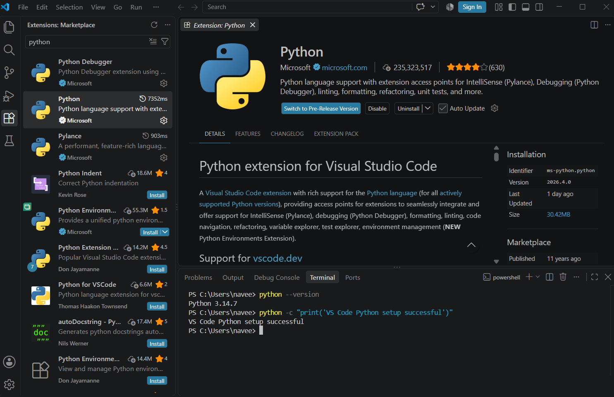

# MSCS 532 - Assignment 1

**Student:** Naga Naveena Chennupati  
**Course:** MSCS 532 - Algorithms and Data Structures  
**Assignment:** Setting Up Python Environment, Visual Studio Code, and Creation of GitHub Account

## Overview

This assignment focused on setting up the development environment for MSCS 532 and implementing the Insertion Sort algorithm introduced in Chapter 2 of *Introduction to Algorithms*. For this assignment, I configured Python and Visual Studio Code, set up Git and GitHub for version control, and implemented Insertion Sort so that the values are arranged in monotonically decreasing order.

## Development Environment

For this assignment, I used the following environment:

- **Python:** 3.14.7
- **Visual Studio Code:** 1.136.1
- **Python Extension:** Official Microsoft extension for VS Code
- **Code Runner:** Jun Han
- **Git:** 2.55.0.windows.5
- **Version Control Platform:** GitHub

Python was verified from both Windows Command Prompt and the VS Code terminal before beginning the programming portion of the assignment.



## Visual Studio Code Setup

Visual Studio Code was updated before starting the assignment. I installed and verified the official Python extension provided by Microsoft and selected Python 3.14.7 as the interpreter.


I also verified that Python could run successfully from the integrated VS Code terminal.



## Git and GitHub Setup

Git was installed and configured locally, with Visual Studio Code selected as Git's default editor. GitHub is being used to host the public repository and maintain the development history of the assignment.

I used multiple commits to show the progression of the work rather than uploading only the completed program. This provides a clearer record of how the solution developed from the initial program structure to implementation, testing, and documentation.

## Insertion Sort in Decreasing Order

Insertion Sort builds a sorted portion of a list one element at a time. Starting with the second element, the current value is compared with values that appear before it.

The key comparison used in my implementation is:

```python
while j >= 0 and values[j] < current_value:

    ## Conclusion

This assignment helped me connect the Insertion Sort algorithm discussed in the course with an actual Python implementation while also establishing a complete development workflow using Visual Studio Code, Git, and GitHub. Modifying the comparison condition demonstrated how the ordering produced by the algorithm can be changed from increasing to decreasing. Testing the implementation with different types of input also helped verify that the solution works correctly beyond a single example.

## Reference

Cormen, T. H., Leiserson, C. E., Rivest, R. L., & Stein, C. (2022). *Introduction to algorithms* (4th ed.). Random House Publishing Services. https://reader2.yuzu.com/books/9780262367509